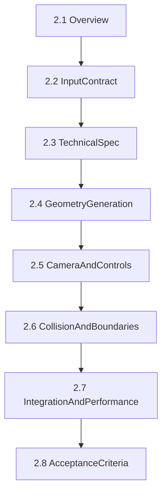

# 步驟 2：2D → 3D 轉換與空間瀏覽（3D Viewer）

> 文件索引：本檔已拆解成「先備知識」與「執行階段」兩類，方便 AI 逐步執行。

---

## 文件結構

### 先備知識（先閱讀）

位於 `docs/Step2/先備知識/`：

- **2.1** [01_Overview.md](./Step2/先備知識/01_Overview.md)
- **2.2** [02_InputContract.md](./Step2/先備知識/02_InputContract.md)
- **2.3** [03_3DTechnicalSpec.md](./Step2/先備知識/03_3DTechnicalSpec.md)

### 執行階段（依序）

位於 `docs/Step2/執行階段/`：

- **2.4** [04_GeometryGeneration.md](./Step2/執行階段/04_GeometryGeneration.md)
- **2.5** [05_CameraAndControls.md](./Step2/執行階段/05_CameraAndControls.md)
- **2.6** [06_CollisionAndBoundaries.md](./Step2/執行階段/06_CollisionAndBoundaries.md)
- **2.7** [07_IntegrationAndPerformance.md](./Step2/執行階段/07_IntegrationAndPerformance.md)
- **2.8** [08_AcceptanceCriteria.md](./Step2/執行階段/08_AcceptanceCriteria.md)

---

## AI 建議執行順序

1. 先讀完 `2.1` ~ `2.3`
2. 依序執行 `2.4 -> 2.5 -> 2.6 -> 2.7`
3. 最後依 `2.8` 做驗收

---

## 拆解原則

- 每份任務單只處理一個核心能力
- 每份任務單都有前置條件、輸入/輸出、完成標準
- 先可用，再優化，確保可逐步交付
